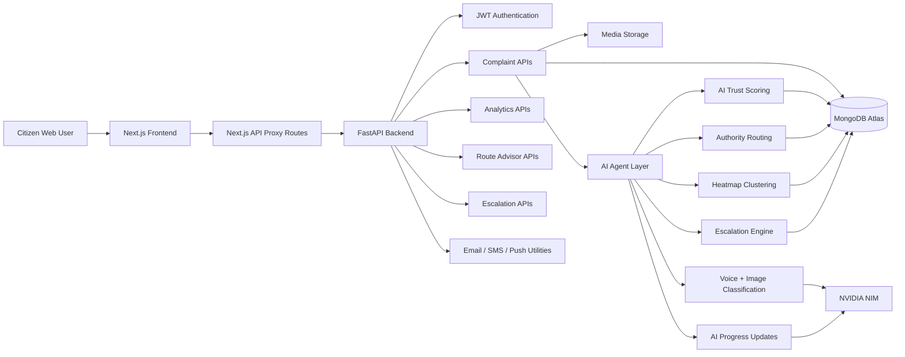
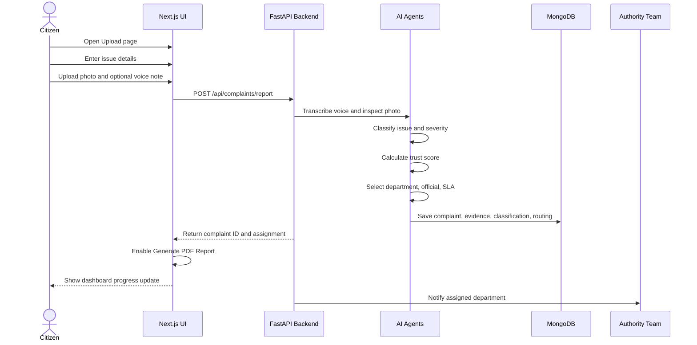
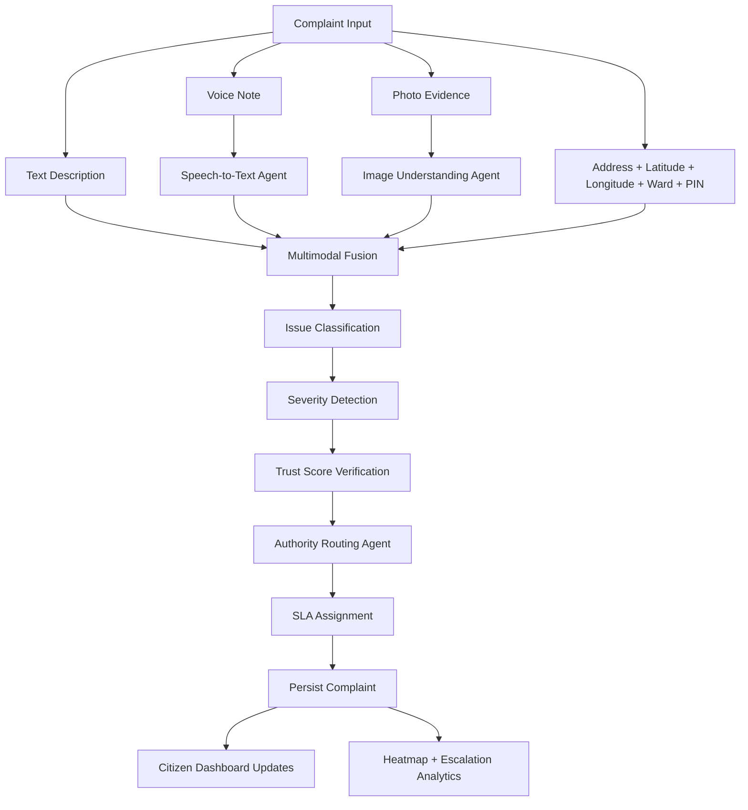
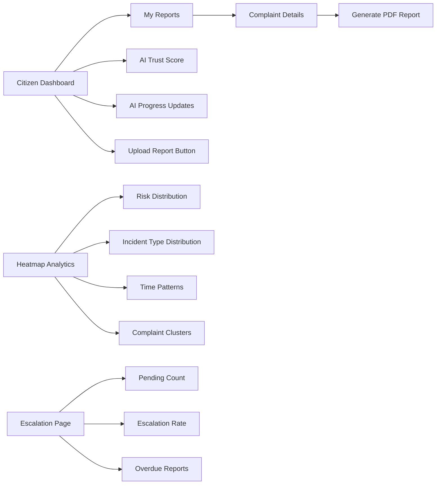
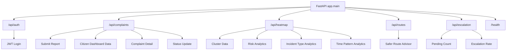
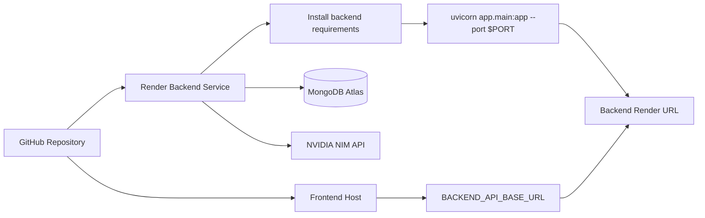
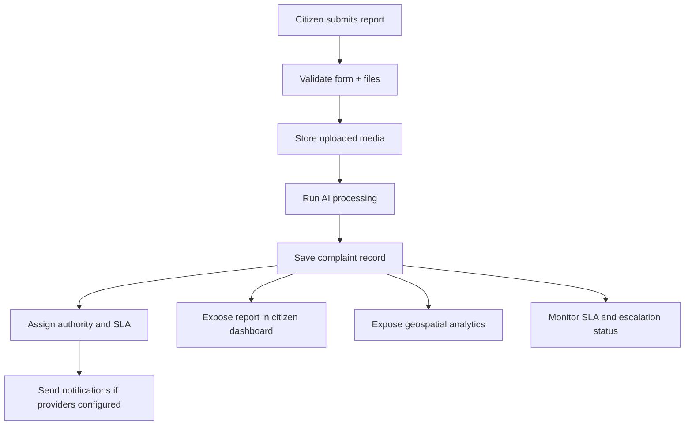

# NagarSeva Architecture

This document visualizes the major system components, user flow, AI-agent workflow, backend API structure, and deployment model.

## High-Level System Architecture

## Citizen Reporting Flow

## AI Agent Pipeline

## Dashboard And Analytics Flow

## Backend API Map

## Deployment Flow

## Core Data Flow

